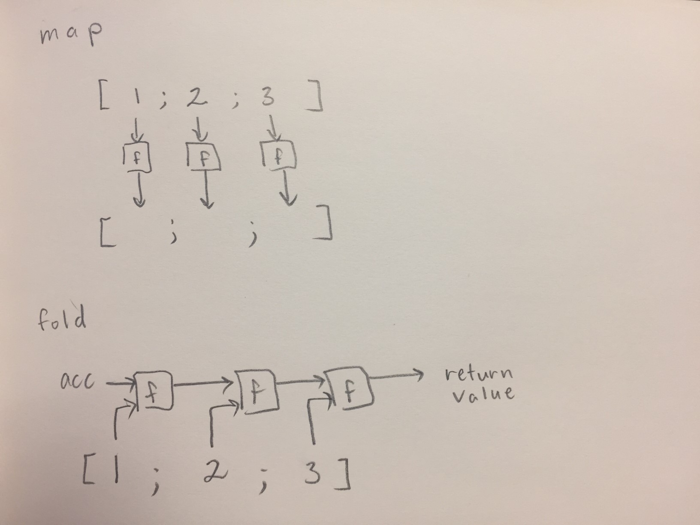

# Discussion 4 - CMSC330 Fall 2019

## OCaml 
1. `Tuples`
   - OCaml supports tuples which are a great way to put together data (which may be heterogenous). E.g. A point on the Cartesian plane can be represented as an `int * int` tuple. Or, if you were using a list to make a dictionary in OCaml, you could have a `('k *'v) list`, which is in face what the associative list in the standard library does.

2. `Anonymous Functions`
    - Functions in OCaml are first-class, meaning they can be used as values (i.e. as arguments and returns).
    - Example:
      - `fun x y -> x::y`
        - This creates a function but since we don't bind it to an identifier, it just disappears into the ether.
        - As practice, consider asking students the type of this expression.
        - Answer is `'a -> 'a list -> ' a list`
      - `let myFun x y = x::y`
        - Essentially has the same data type as the previous anonymous function, but is bound to the identifier `myFun`

3. `Higher Order Functions`
    * Higher order functions are functions which take functions as arguments.
    * `map`
        * Has 2 args:
            * A function w/ 1 arg
            * A list
        * `map` calls the function on each element of the list and returns a list of the results. (Draw/Show the picture.)
        * Examples:
            * `map (fun x -> x + 1) [1; 2; 3]` -> `[2; 3; 4]`
            * `map float_of_int [1; 2; 3]` -> `[1.0; 2.0; 3.0]`
    * `fold`
        * Has 3 args
            * A function w/ 2 args
            * An initial value for the accumulator
            * A list
        * For each element of the list, `fold` calls the function on the accumulator and the element, using the return value as the accumulator for the next call. It returns the final value of the accumulator. (Draw/Show the picture.)
        * Examples (step through these):
            * `fold (fun acc x -> acc + x) 0 [1; 2; 3]` -> `6`
            * `fold (fun acc x -> acc && x) true [false; true; false; true]` -> `true`
    * **Note:** There is a difference between `fun_name1 arg1 fun_name2 arg2` and `fun_name1 arg1 (fun_name2 arg2)`. The former has 3 arguments and the latter has 2, where the second argument is the result of evaluating `fun_name2` on `arg2`.
            

