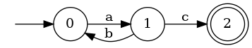

# Project 3: Regular Expression Engine

Due: October 17 (Late October 18) at 11:59:59 PM

Points: 35P/35R/30S

## Introduction

Your job is to implement the `Nfa` (in the `src/nfa.ml` file)
and `Regex` (in the `src/regex.ml`) modules,
which implement NFAs and a regular expression engine.

You are allowed to use the library functions found in
the [`Pervasives` module][pervasives doc],
as well as functions from
the [`List`][list doc] and
[`String`][string doc] modules.
As in the previous project,
you are not allowed to use imperative OCaml.
The only imperative feature you may use is the provided `fresh` function in Part 3.
You will receive a 0 for any functions using restricted features.

We have provided a `Sets` module that correctly implements the functions from Project 2A
and a couple more functions.
You can see the [documentation](SETS.md) for more information.
**All `dune` commands must be prefixed with `OCAMLPATH=dep` for this dependency to be loaded correctly.**

## Debugging

For debugging your implementation, we've provided the `viz` target.
When you run this command,
it will read a regular expression from standard in,
compose an NFA from it,
and export that NFA to Graphviz before rendering to a PNG.

1. You can compile the binary with `OCAMLPATH=dep dune build bin/viz.bc`.
2. Run the command `OCAMLPATH=dep dune exec bin/viz.bc` to open the input shell.
3. Follow the instructions.
4. Use an image viewer of choice to open `output.png`.

You can also use `utop` for debugging.
The `P3.Parser` module contains a `regex_of_string` function
that parses a plaintext regular expression
into a value of type `Regex.t`.

For example, `P3.Parser.regex_of_string "(a|bc|E)d*"`.
This is mostly self-explanatory,
except the `E` represents an epsilon.

You can also use utop as you've done before but with the previously mentioned prefix (`OCAMLPATH=dep`):

1. Open utop with `OCAMLPATH=dep dune utop src`
2. Load the file you want to test with `open P3.Nfa` or whichever .ml file you wish to test.
2. Test whichever functions you want to!

## Part 1: NFAs

Before starting,
you'll want to familiarize yourself with the types you will be working with.
Look at the `nfa.ml` file.

The type `Nfa.nfa` is the type representing NFAs.
It is modeled after the formal definition of an NFA, a 5-tuple (Q, Σ, δ, q0, F) where:

1. Q is a finite set of states,
2. Σ is a finite alphabet,
3. δ : Q × (Σ ∪ {ε}) → P(Q) is the transition function,
4. q0 ∈ Q is the start state, and
5. F ⊆ Q is the set of accept states.

We translate this definition into OCaml in a straightforward way using record syntax:

```
type ('q, 's) transition = 'q * 's option * 'q
type ('q, 's) nfa = {
    qs : 'q list;
    ss : 's list;
    ts : ('q, 's) transition list;
    q0 : 'q;
    fs : 'q list;
}
```

Notice the types are parametric in state `'q` and symbol `'s`.

The type `transition` represents NFA transitions. For example:
```
let t1 = (0, Some c, 1) (* Transition from state 0 to state 1 on character 'c' *)
let t2 = (1, None, 0)   (* Transition from state 1 to state 0 on epsilon *)
```

An example NFA would be:

```
let m = {
    qs = [0; 1; 2];
    ss = ['a'];
    ts = [(0, Some 'a', 1); (1, None, 2)];
    q0 = 0;
    fs = [2]
}
```

This looks like:


Here is a DFA:

```
let n = {
    qs = [0; 1; 2];
    ss = ['a'; 'b'; 'c'];
    ts = [(0, Some 'a', 1); (1, Some 'b', 0); (1, Some 'c', 2)];
    q0 = 0;
    fs = [2]
}
```

This looks like:



You must implement the following functions as specified.

### `move m qs s`

* Type: `('q, 's) Nfa.nfa -> 'q list -> 's option -> 'q list`
* Description: This function takes as input an NFA, a list of initial states, and a symbol option. The output will be a list of states (in any order, with no duplicates) that the NFA might be in after making one transition on the symbol (or epsilon if None), starting from one of the initial states given as an argument to move.
* Examples:
```
move m [0] (Some 'a') = [1] (* m is the first NFA defined above *)
move m [1] (Some 'a') = []
move m [2] (Some 'a') = []
move m [0;1] (Some 'a')  = [1]
move m [1] None = [2]
```
* Explanation:
  1. `move` on `m` from `0` with `Some a` returns `[1]` since from 0 to 1 there is a transition with character `a`.
  2. `move` on `m` from `1` with `Some a` returns `[]` since from 1 there is no transition with character `a`.
  3. `move` on `m` from `2` with `Some a` returns `[]` since from 2 there is no transition with character `a`.
  4. `move` on `m` from `0` and `1` with `Some a` returns `[1]` since from 0 to 1 there is a transition with character `a` but from 1 there was no transition with character `a`.
  5. Notice that the NFA uses an implicit dead state. If `s` is a state in the input list and there are no transitions from `s` on the input character, then all that happens is that no states are added to the output list for `s`.
  6. `move` on `m` from `1` with `None` returns `[2]` since from 1 to 2 there is an epsilon transition.

### `e_closure m qs`

* Type: `('q, 's) Nfa.nfa -> 'q list -> 'q list`
* Description: This function takes as input an NFA and a list of states. The output will be a list of states (in any order, with no duplicates) that the NFA might be in making zero or more epsilon transitions, starting from the list of initial states given as an argument to `e_closure`.
* Examples:
```
e_closure m [0] = [0] (* where m is the NFA created above *)
e_closure m [1] = [1;2]
e_closure m [2]  = [2]
e_closure m [0;1] = [0;1;2]
```
* Explanation:
  1. `e_closure` on `m` from `0` returns `[0]` since there is no where to go from `0` on an epsilon transition.
  2. `e_closure` on `m` from `1` returns `[1;2]` since from `1` you can get to `2` on an epsilon transition.
  3. `e_closure` on `m` from `2` returns `[2]` since there is no where to go from `2` on an epsilon transition.

### `accept m s`

* Type: `('q, char) Nfa.nfa -> string -> bool`
* Description: This function takes an NFA and a string, and returns true if the NFA accepts the string, and false otherwise. You will find the functions in the [`String` module][string doc] to be helpful. **You must implement this function without using `dfa_of_nfa`.**
* Examples:
```
accept n "" = false  (* n is the NFA defined above *)
accept n "ac" = true
accept n "abc" = false
accept n "abac" = true
```
* Explanation:
  1. `accept` on `n` with the string "" returns false because initially we are at our start state 0 and there are no characters to exhaust and we are not in a final state.
  2. `accept` on `n` with the string "ac" returns true because from 0 to 1 there is an 'a' transition and from 1 to 2 there is a 'c' transition and now that the string is empty and we are in a final state thus the nfa accepts "ac".
  3. `accept` on `n` with the string "abc" returns false because from 0 to 1 there is an 'a' transition but then to use the 'b' we go back from 1 to 0 and we are stuck because we need a 'c' transition yet there is only an 'a' transition. Since we are not in a final state thus the function returns false.
  4. `accept` on `n` with the string "abac" returns true because from 0 to 1 there is an 'a' transition but then to use the 'b' we go back from 1 to 0 and then we take an 'a' transition to go to state 1 again and then finally from 1 to 2 we exhaust our last character 'c' to make it to our final state. Since we are in a final state thus the nfa accepts "abac". 4. eclosure on `m` from `0` and `1` returns `[0;1;2]` since from `0` you can only get to yourself and from `1` you can get to `2` on an epsilon transition but from `2` you can't go anywhere.

## Part 2: The Subset Construction

Our goal is to implement the `dfa_of_nfa` function which determinizes,
using the subset construction,
an NFA.
Every DFA is an NFA (not the other way around though),
a restricted kind of NFA.
Namely, it may not have non-deterministic transitions
(i.e. epsilon transitions or more than one transition out of a state with the same symbol).
Hence, our DFA type is `('q list, 's) Nfa.nfa`.
Notice that our states are now sets of states from the NFA.

### `dfa_of_nfa m`

* Type: `('q, 's) Nfa.nfa -> ('q list, 's) Nfa.nfa`
* Description: This function takes as input an NFA and converts it to an equivalent DFA. The language recognized by an NFA is invariant under `dfa_of_nfa`. In other words, for all NFAs `m` and for all strings `s`, `accept m s = accept (dfa_of_nfa m) s`.

## Part 3: Regular Expressions

The `Regex` module contains the following type declaration:

```
type t =
  | Empty
  | Char of char
  | Union of t * t
  | Concat of t * t
  | Star of t
```

Here `t` is a user-defined OCaml variant datatype representing regular expressions.

* `Empty` represents the regular expression recognizing the empty string (not the empty set!). Written as a formal regular expression, this would be `epsilon`.
* `Char c` represents the regular expression that accepts the single character c. Written as a formal regular expression, this would be `c`.
* `Union (r1, r2)` represents the regular expression that is the union of r1 and r2. For example, `Union(Char 'a', Char'b')` is the same as the formal regular expression `a|b`.
* `Concat (r1, r2)` represents the concatenation of r1 followed by r2. For example, `Concat(Char 'a', Char 'b')` is the same as the formal regular expresion `ab`.
* `Star r` represents the Kleene closure of regular expression r. For example, `Star (Union (Char 'a', Char 'b'))` is the same as the formal regular expression `(a|b)*`.

You must implement your own function to convert a regular expression (in the above format) to an NFA, which you can then use to match particular strings (by leveraging your `Nfa` module). You must also implement a function that turns `Regex.t` structures back into a string representation.

### `nfa_of_regex r`

* Type: `Regex.t -> Nfa.nfa`
* Description: This function takes a regexp and returns an NFA that accepts the same language as the regular expression. Notice that as long as your NFA accepts the correct language, the structure of the NFA does not matter since the NFA produced will only be tested to see which strings it accepts.

[list doc]: https://caml.inria.fr/pub/docs/manual-ocaml/libref/List.html
[string doc]: https://caml.inria.fr/pub/docs/manual-ocaml/libref/String.html
[modules doc]: https://realworldocaml.org/v1/en/html/files-modules-and-programs.html
[pervasives doc]: https://caml.inria.fr/pub/docs/manual-ocaml/libref/Pervasives.html
[git instructions]: ../git_cheatsheet.md
[wikipedia inorder traversal]: https://en.wikipedia.org/wiki/Tree_traversal#In-order
[submit server]: submit.cs.umd.edu
[web submit link]: image-resources/web_submit.jpg
[web upload example]: image-resources/web_upload.jpg
